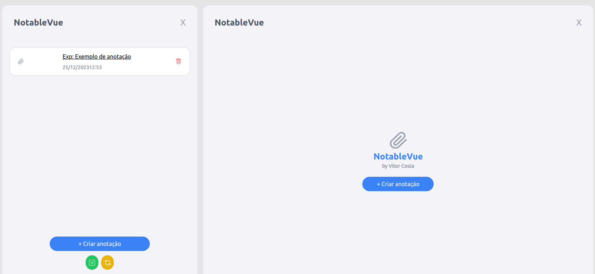
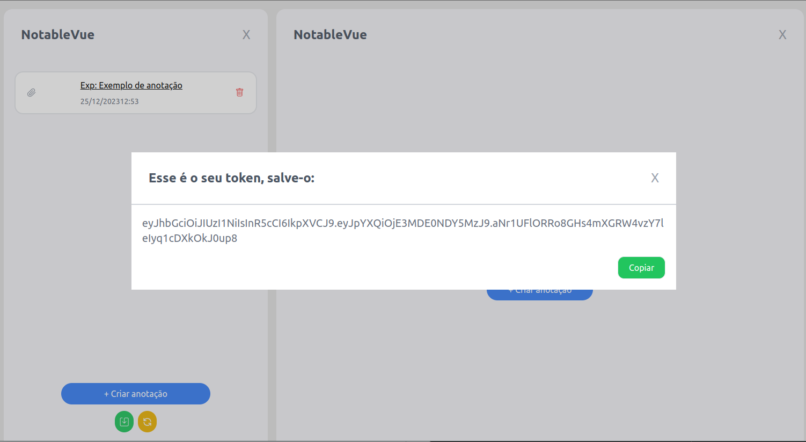

<h1><a href="https://github.com/vitorcosta42/NotableVue"> NotableVue - Vitor Costa </a></h1>

    
    
    
    
    

<h2>Descrição</h2>

  Esse projeto carinhosamente nomeado como NotableVue é um teste técnico full-stack utilizando Vue.js e Tailwind para o Front-end, e IndexDB, Node, Express e MongoDB para o back-end. Temos criação, edição, exclusão e listagem de anotações em um projeto simples e amigável aos usuários. 

<h2>Como utilizar</h2>

<h3>1. Clone o repositório:</h3>
<pre>
  <code>
    git clone https://github.com/vitorcosta42/NotableVue.git
  </code>
</pre>

<h3>2. Configuração do MongoDB:</h3>

  
 Antes de iniciar a aplicação, você precisará configurar um banco de dados MongoDB. Siga as etapas abaixo:

1. Acesse o [MongoDB Atlas] (https://www.mongodb.com/cloud/atlas) e faça login ou crie uma conta, se necessário.
   
2. Crie um novo cluster MongoDB ou use um já existente. Isso pode levar alguns minutos.
    
4. Crie um novo banco de dados. Anote o nome do banco de dados que você criar.

5. Certifique-se de adicionar o IP do seu servidor à lista de IPs permitidos.

6. Anote o endereço do cluster MongoDB, pois você precisará dele para configurar a aplicação.
  

<h3>3. Entre no repositório clonado e instale as dependências:</h3>
<pre>
  <code>
    npm install
  </code>
</pre>

<h3>4. Configure as variáveis de ambiente:</h3>
<pre>
  <code>
    Crie um arquivo .env na raiz do projeto e adicione as seguintes linhas:
    MONGODB_PASSWORD=sua_senha_do_mongo
    JWT_SECRET=sua_chave_secreta
  </code>
</pre>

<h3>5. Inicie o servidor Vue e o servidor Node</h3>
<pre>
  <code>
    npm run dev
  </code>
</pre>
<pre>
  <code>
    node server.js
  </code>
</pre>

<h6>Após realizar esta sequência de passos a aplicação já estará pronta para ser utilizada, se seguiu o padrão do Vite, ela poderá ser acessada em <a href="http://localhost:5173/" >http://localhost:5173/</a> </h6>
<h3>6. Persistir Dados e Recuperar Dados </h3>

<pre>
  <code>
    Para persistir dados basta o usuário apertar no botão verde na parte inferior, um Modal surgirá com seu token
  </code>
   
</pre>

<pre>
  <code>
    Para recuperar dados, o usuário apertará no botão amarelo, um Modal surgirá e ele digitará seu token 
  </code>
   
</pre>

<h3>7. Endpoints da API:</h3>
<pre>
  <code>
    POST /api/persist - Envia as notas cadastradas no IndexDB ao banco de dados e gera um token de recuperação.
    GET /api/retrieve/:token - Recupera notas associadas a um token.
  </code>
</pre>

<h3>8. Considerações de Implantação:</h3>
  
Em um ambiente de produção, certifique-se de gerenciar de forma segura informações sensíveis, como senhas e chaves secretas.

<h2>Créditos</h2>
<table>
  <tr>
    <td align="center">
      <a href="https://github.com/vitorcosta42">
         
        
          <b>Vitor Costa</b>
        
      </a>
    </td>
  </tr>
</table>

<h2>Licença</h2>
<b>All Rights Reserved</b>
